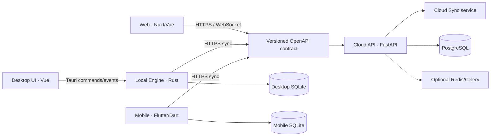
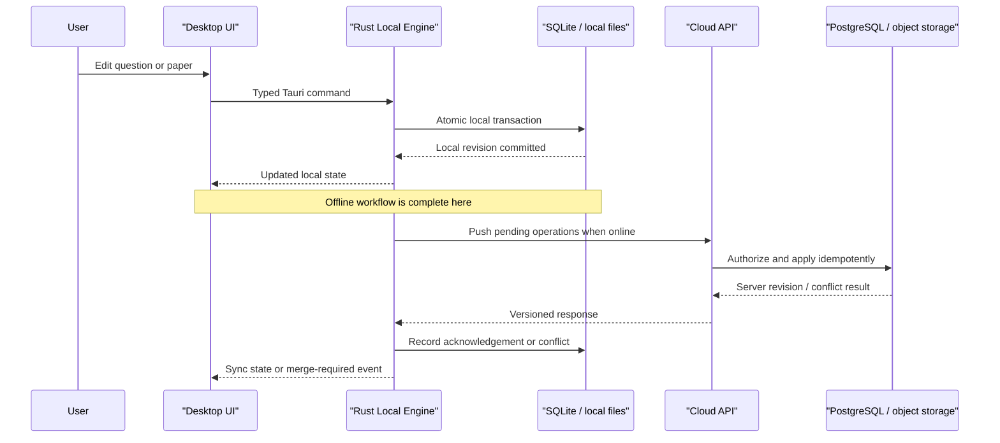
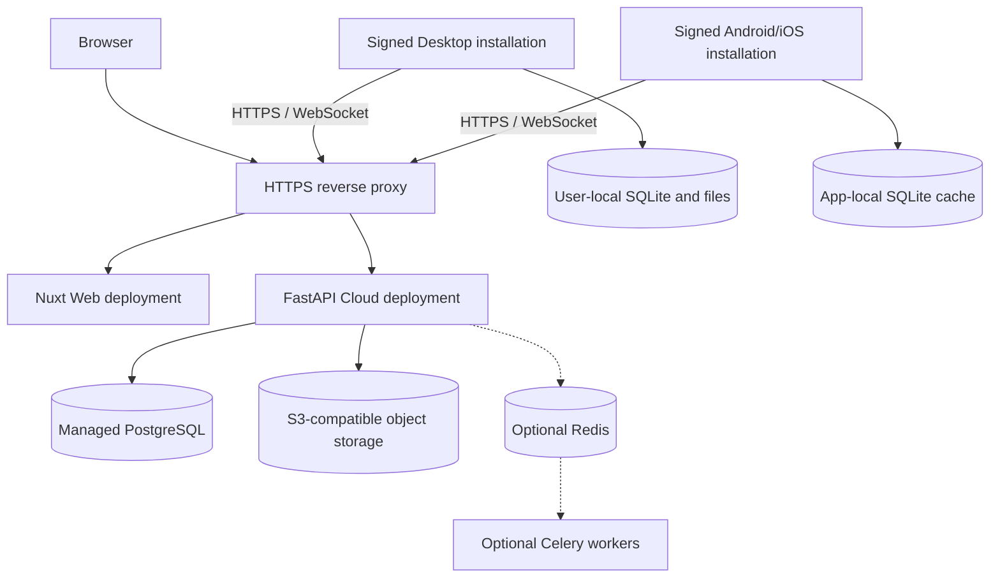

# ADR-0001: Platform Repository and Runtime Boundaries

- Status: Proposed
- Date: 2026-08-02
- Decision owners: TestPapers maintainers
- Linear: [CLE-13](https://linear.app/clearders/issue/CLE-13)
- Supersedes: none

## Context

TestPapers currently ships as two independently deployed repositories:

- [`Clearders/TestPapers`](https://github.com/Clearders/TestPapers), a Nuxt 4/Vue 3 Web application.
- [`Clearders/TestPaper-backend`](https://github.com/Clearders/TestPaper-backend), a FastAPI/PostgreSQL cloud service with REST, WebSocket, collaborative drafts, asynchronous tasks, and document export.

The v2 product adds a Tauri Desktop application and a Flutter Mobile companion while preserving the existing Web release. Desktop must work offline without PostgreSQL, Redis, or Celery. Mobile must support offline capture and review. Both native clients eventually synchronize with the cloud without importing cloud persistence code.

The repository topology, repository governance, and runtime boundaries must therefore be stable before API generation, local/cloud data ownership, Desktop scaffolding, or sync protocol work begins.

## Decision drivers

1. Keep the current Web site independently releasable throughout the migration.
2. Let Web, Cloud, Desktop, and Mobile use different release cadences and toolchains.
3. Prevent clients from depending on PostgreSQL, SQLAlchemy, Redis, Celery, or cloud service internals.
4. Make offline Desktop behavior deterministic and packageable without a Python runtime.
5. Establish one machine-readable cloud contract across TypeScript, Rust, and Dart.
6. Establish the new application repositories early without moving or renaming the current Web and Cloud repositories.
7. Preserve useful behavior without treating implementation-language reuse as a goal in itself.

## Options considered

| Option | Advantages | Costs and risks | Decision |
| --- | --- | --- | --- |
| Immediate monorepo | Atomic cross-platform changes; one place for tooling and architecture docs | Disrupts the current Web and Cloud release paths; couples Node, Python, Rust, and Flutter tooling; creates a large migration before user value | Rejected |
| Two repositories with shared source packages | Keeps Cloud separate while allowing Web/Desktop/Mobile source sharing | Makes one client repository responsible for unrelated release trains; shared source packages do not cross TypeScript/Rust/Dart cleanly; moving the current Web remains risky | Rejected |
| Permanent application repositories with staged migration | Preserves current deployments; gives every runtime an explicit owner and release train; contract changes remain reviewable | Cross-repository changes require coordination; generated clients and compatibility checks become mandatory | Accepted |

The selected topology is permanent separation by deployable application. Migration is incremental: no current source tree is moved as part of this decision.

## Repository topology

| Repository | Runtime owner | Main responsibilities | Release unit |
| --- | --- | --- | --- |
| `Clearders/TestPapers` | Web | Nuxt SSR UI, cloud administration, sharing, publishing, realtime collaboration | Web deployment |
| `Clearders/TestPaper-backend` | Cloud | FastAPI contract, accounts, shared data, collaboration, synchronization endpoints, object storage, notifications | Cloud deployment |
| `Clearders/TestPapers-Desktop` | Desktop | Tauri/Vue UI, Rust Local Engine, SQLite, offline authoring, generation, export, backup, sync client | Desktop installer |
| `Clearders/TestPapers-Mobile` | Mobile | Flutter UI, mobile SQLite cache, capture/OCR drafts, browsing, review, notifications, sync client | Android/iOS application |

`CLE-58` creates `Clearders/TestPapers-Desktop` and `Clearders/TestPapers-Mobile` during the M1 architecture and engineering baseline. That issue establishes repository ownership, default branches, protection rules, contribution and security documents, and code-neutral checks; it does not generate either application framework. `CLE-23` and `CLE-35` later materialize the following target application structures in those existing repositories:

```text
TestPapers-Desktop/
  src/                       # Vue presentation layer
  src-tauri/
    src/
      application/           # use cases and transaction boundaries
      domain/                # local domain rules
      infrastructure/        # SQLite, files, secure storage, networking
      ipc/                   # narrow Tauri command/event adapters
      sync/                  # cloud protocol adapter
    migrations/
  tests/

TestPapers-Mobile/
  lib/
    app/                     # composition, navigation, platform services
    domain/                  # mobile domain rules
    data/                    # SQLite and cloud adapters
    features/                # capture, browse, review, notifications
    sync/                    # cloud protocol adapter
  test/
  integration_test/
```

Repository separation does not prohibit published artifacts. It prohibits source-level imports across application repositories.

## Component and dependency boundaries



Dependencies must point inward through public interfaces:

- Web imports only Web-owned modules and generated cloud contract types. It accesses Cloud through REST/WebSocket.
- Desktop UI cannot access SQLite, the filesystem, secure credentials, or Cloud directly. It calls an allowlisted Tauri command/event interface.
- The Rust Local Engine owns Desktop SQLite migrations, offline transactions, file lifecycle, backup/restore, generation/export orchestration, and the Desktop sync adapter.
- Mobile owns its Flutter presentation and local cache. It accesses Cloud through a generated Dart client and never calls the Desktop Local Engine.
- Cloud route handlers depend on cloud application/services and repositories. Its SQLAlchemy models and repository implementations are private.
- Redis and Celery are optional Cloud infrastructure. Their absence must not change the public API contract or become a client concern.

Forbidden dependencies include:

- Any client importing SQLAlchemy models, Alembic migrations, Cloud repositories, worker tasks, or Redis/Celery configuration.
- Desktop UI issuing SQL or bypassing the Rust application layer.
- Web or Mobile importing Desktop IPC commands as a shared domain API.
- A client build requiring another application repository to be checked out at a relative path.

## Public contracts

FastAPI's generated OpenAPI document is the sole machine-readable Cloud API source. `CLE-14` will make it reproducible and add compatibility gates.

- Cloud CI publishes an immutable `openapi.json` artifact for each API release.
- Web/Desktop generate and pin TypeScript/Rust-facing contract code as appropriate; Mobile generates and pins Dart contract code.
- Generated output belongs to the consuming repository and is updated through an explicit contract-upgrade change.
- Application repositories do not share hand-written DTO source files.
- Additive changes are preferred. Breaking changes require an explicit API version, migration notes, a supported compatibility window, and coordinated consumer upgrades.
- REST resources use public opaque identifiers. Database primary keys and ORM representations are not public contracts.

This ADR fixes ownership and dependency direction only. Field-level local/cloud ownership is defined by `CLE-15`; sync operations, conflict semantics, deletion propagation, and protocol versioning are defined by `CLE-29`.

## Runtime data flow



Web remains cloud-first. Desktop remains local-first. Mobile is offline-capable but does not become the authoritative professional authoring runtime. Cloud owns shared and collaborative state; each native application owns its local replica and pending-operation queue. No synchronization path writes directly to another runtime's database.

## Deployment topology



- Web and Cloud continue to deploy independently behind the existing same-origin reverse proxy.
- Desktop packages the Rust Local Engine inside the Tauri application. It opens no unauthenticated local HTTP port.
- Desktop and Mobile store long-lived native credentials only through operating-system secure storage; native authentication details are decided in `CLE-18`.
- PostgreSQL, object storage, Redis, and Celery are never installed as client prerequisites.

## Existing-code disposition

| Existing area | Disposition | Rationale |
| --- | --- | --- |
| Nuxt pages, components, composables, SSR middleware, CSP, and deployment | Keep in `TestPapers` | Web remains a supported independent product |
| Framework-neutral TypeScript domain rules | Keep in Web; selectively port with tests when Desktop needs them | Avoid a premature shared-source dependency |
| Vue components suitable for Desktop | Copy/port intentionally with provenance and platform adaptations | Reuse behavior and design without coupling releases |
| FastAPI routes, services, repositories, auth, collaboration, and WebSocket | Keep in `TestPaper-backend` | These are Cloud responsibilities |
| SQLAlchemy models and Alembic history | Keep Cloud-private | PostgreSQL schema is not a client model |
| Genetic paper generation and DOCX/TeX export behavior | Specify with fixtures and port behind Rust interfaces for Desktop | Offline Desktop cannot require Python or Cloud availability |
| Redis/Celery tasks | Keep optional and Cloud-only; audit under `CLE-43` | They are scaling/latency infrastructure, not product contracts |
| Current hand-maintained API documentation and TypeScript response types | Preserve until `CLE-14` replaces duplication safely | Avoid an incompatible cutover |

Copying or porting code requires tests that demonstrate behavioral parity. Git history is not rewritten, and the existing repositories are not moved or renamed.

## Migration sequence

1. **Architecture decision (`CLE-13`)**: accept this ADR without changing runtime behavior.
2. **Repository baseline (`CLE-58`)**: create and govern the Desktop and Mobile repositories without moving current source or generating Tauri/Flutter projects.
3. **Contract baseline (`CLE-14`)**: export deterministic OpenAPI, generate and pin consumer code in the existing application repositories, and gate incompatible diffs while retaining current endpoints.
4. **Ownership and environment (`CLE-15`, `CLE-16`)**: define local/cloud fields, identifiers, per-repository configuration layers, and supported toolchains.
5. **Regression gate (`CLE-17`)**: capture current Web/Cloud journeys before native clients consume the contract.
6. **Desktop foundation (`CLE-23`, `CLE-24`, `CLE-25`)**: scaffold Tauri/Vue in the existing Desktop repository, establish typed IPC and the Rust Local Engine, then add SQLite migrations.
7. **Desktop vertical slices (`CLE-26`–`CLE-28`)**: deliver offline question-bank, generation/export, and backup/restore behavior.
8. **Synchronization (`CLE-29`–`CLE-34`)**: define the protocol before implementing Cloud logs, client queues, conflicts, attachments, and fault-injection tests.
9. **Mobile foundation (`CLE-35`, `CLE-36`)**: scaffold Flutter in the existing Mobile repository after sync semantics and failure behavior are stable, then implement its SQLite cache and sync client.

Every step must be backward-compatible with the current Web deployment. Cross-repository work uses the same Linear issue identifier on each pull request.

## Consequences

### Positive

- Existing Web and Cloud release paths remain intact.
- Each application can use its native toolchain and release independently.
- Rust provides a single packaged Desktop trust boundary for storage, IPC, and offline behavior.
- Contract changes become explicit, versioned, and testable across repositories.
- Mobile development does not block Desktop or Web releases.

### Costs

- Cross-repository features need coordinated pull requests and compatibility windows.
- Some framework-neutral behavior will be ported rather than directly imported.
- Generated-client drift must be caught by automation.
- Behavioral fixtures are required when Python functionality is reimplemented in Rust.

### Risks and mitigations

| Risk | Mitigation |
| --- | --- |
| API/client drift | Deterministic OpenAPI artifact, generated code, and compatibility checks in `CLE-14` |
| Divergent domain behavior | Shared language-neutral fixtures and parity tests owned by the relevant feature issue |
| Cross-repository rollout failure | Additive server changes first, pinned clients, compatibility window, then server cleanup |
| Desktop IPC expansion | Allowlisted typed commands, validation in Rust, no generic SQL/filesystem command |
| Accidental Cloud dependency in offline paths | Offline end-to-end tests with Cloud, PostgreSQL, Redis, and Celery unavailable |
| Documentation divergence | This file is canonical; other repositories link to it instead of copying it |

## Revisit conditions

Reconsider repository topology only through a superseding ADR if at least one of these becomes persistent:

- Most feature changes require coordinated modifications in three or more repositories.
- Contract generation cannot provide safe compatibility across supported client versions.
- Duplicated domain behavior produces repeated production defects despite shared fixtures.
- Release engineering overhead exceeds the isolation benefit for multiple consecutive milestones.

A superseding decision must still preserve independent deployability and an explicit offline trust boundary.

## Acceptance checklist

- [x] Web, Desktop, Mobile, Cloud, Local Engine, and Sync Engine responsibilities are explicit.
- [x] Monorepo, two-repository/shared-source, and permanent separate-repository strategies are compared.
- [x] Current repositories and target repository structures are documented.
- [x] M1 creates and governs the Desktop and Mobile repositories separately from later Tauri/Flutter scaffolding.
- [x] Dependency direction forbids client access to cloud persistence implementations.
- [x] Component, data-flow, and deployment diagrams are included.
- [x] Existing code is classified as retained, ported, or temporarily preserved.
- [x] Migration steps preserve the current Web release path.
