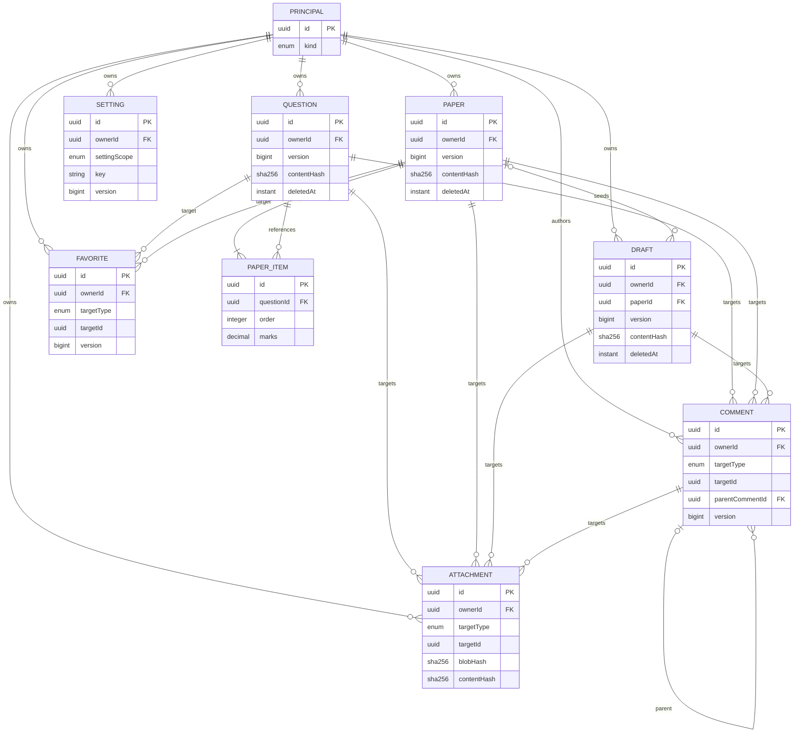
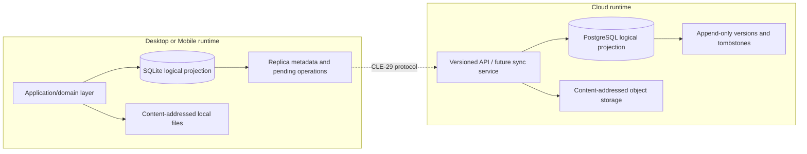

# ADR-0002: Local/Cloud Domain Model and Ownership

- Status: Accepted
- Date: 2026-08-02
- Decision owners: TestPapers maintainers
- Linear: [CLE-15](https://linear.app/clearders/issue/CLE-15)
- Depends on: [ADR-0001](0001-platform-repository-and-runtime-boundaries.md)
- Machine-readable field dictionary: [`domain-model.json`](../data-model/domain-model.json)

## Context

ADR-0001 separates Web, Cloud, Desktop, and Mobile by deployable runtime. It deliberately does not make PostgreSQL or SQLAlchemy the cross-platform domain model: Desktop must author offline against SQLite, Mobile needs an offline cache, and every client must communicate with Cloud through public contracts.

The existing Cloud implementation predates offline synchronization. Questions, papers, shared drafts, and draft comments expose UUID `publicId` values, but Cloud tables still use integer relationship keys. Only shared drafts have an optimistic revision. Question images are embedded JSON, favorites and persisted settings do not exist, and domain rows have neither content hashes nor tombstones. Browser-only drafts and theme preferences are stored outside the Cloud model.

Before implementing SQLite or a sync protocol, the platform therefore needs one implementation-neutral answer to four questions:

1. What is the stable identity and field dictionary for each synchronized entity?
2. Which principal owns a record, and which runtime is authoritative in each replication scope?
3. What invariants must deletion, restoration, history, and conflicts preserve?
4. How can independent Alembic and SQLite migrations implement the same logical model without importing each other's persistence code?

## Decision

TestPapers adopts the versioned logical contract in [`docs/data-model/domain-model.json`](../data-model/domain-model.json). This ADR explains the decisions and is the human-readable architecture record; the JSON file is the field dictionary and parity input for future Cloud and native migrations.

The contract covers exactly these product entities:

- `question`
- `paper`
- `draft`
- `attachment`
- `comment`
- `favorite`
- `setting`

Every entity has one immutable stable ID, one logical owner, a common version/hash/tombstone envelope, explicit local and PostgreSQL projections, and a replication rule for every supported scope.

### Scope boundaries

This decision defines the domain and storage-projection invariants. It does not implement persistence or transport:

- `CLE-25` implements Desktop SQLite tables, migrations, repositories, and startup/recovery behavior.
- `CLE-36` implements the Mobile SQLite cache.
- `CLE-29` defines sync operations, cursors, idempotency keys, acknowledgements, retries, wire errors, merge algorithms, and protocol versioning.
- `CLE-19` defines shared-library private/team/public publication, roles, withdrawal, forks, and subscriptions.
- Future Cloud feature issues add Alembic revisions and APIs when each domain capability is implemented.

No client imports SQLAlchemy models or Alembic migrations. No Cloud migration is copied into a native repository. The independent migrations must instead satisfy the same checked logical contract.

## Terminology

| Term | Meaning |
| --- | --- |
| Logical owner | The single user, local profile, or system principal responsible for a record. It is not the database server. |
| Authority | The runtime allowed to accept the canonical value for a field. |
| Canonical store | The store containing accepted state for one replication scope. |
| Replica | A queryable offline copy plus, when applicable, unacknowledged local edits. |
| Tombstone | A newer logical version whose `deletedAt` is non-null. It prevents an older replica from recreating deleted data. |
| Replication scope | `local_private`, `cloud_synced`, or `collaborative_shared`; this selects storage authority, not publication visibility or ACL. |
| Domain content | Fields that determine the user-visible semantic payload and therefore enter `contentHash`. |
| Projection field | Runtime-private persistence data such as a local path or Cloud object key. It never enters synchronized domain content. |

## Stable identifiers

All entity and cross-entity references use an immutable UUID serialized as lowercase, hyphenated, 36-character text.

- New offline-capable implementations generate UUIDv7 in the runtime that creates the record, before the first write.
- Existing UUIDv4 `publicId` values are valid forever and are adopted as the logical `id`; migration never rewrites them.
- PostgreSQL may keep integer surrogate primary keys for internal joins, but every logical row has a unique stable ID and all public/sync references resolve through it.
- SQLite stores the stable ID directly. A client never persists a Cloud integer key as domain identity.
- Embedded ordered relationships also need stable identity. Each `paperItem` has its own UUID so reorder, marks changes, and snapshots do not depend on array position.
- IDs are never reused after deletion or physical purge.

UUIDv7 is a creation recommendation, not a compatibility gate: identity equality never depends on UUID version or time ordering.

## Common synchronization envelope

Every entity resolves to the following common fields plus its entity-specific fields. Names are logical camelCase names; physical column names are declared separately in the field dictionary.

| Field | Type | Required | Authority | Hash | Meaning |
| --- | --- | --- | --- | --- | --- |
| `id` | stable ID | yes | identity | excluded | Immutable cross-runtime identity |
| `ownerId` | stable ID | yes | ownership | excluded | Exactly one logical owner principal |
| `replicationScope` | enum | yes | scope transition | excluded | Local private, cloud synchronized, or collaborative shared |
| `schemaVersion` | positive signed 32-bit | yes | identity | excluded | Canonical payload shape version in `1..2^31-1` |
| `version` | positive signed 64-bit | yes | lifecycle | excluded | Monotonic accepted mutation in `1..2^63-1`, including delete and restore |
| `contentHash` | SHA-256 | yes | lifecycle | excluded | Digest of canonical domain content |
| `createdAt` | UTC instant | yes | lifecycle | excluded | Canonical creation time |
| `updatedAt` | UTC instant | yes | lifecycle | excluded | Canonical time of the accepted version |
| `deletedAt` | UTC instant | no | lifecycle | excluded | Non-null means this version is a tombstone |
| `deletedById` | stable ID | no | attribution | excluded | Principal that created the current tombstone |

`version` is the platform term. The current shared-draft `revision` maps to it during migration; new cross-platform contracts must not create a second competing version counter.

## Logical ERD

The ERD shows logical stable-ID relationships, not current PostgreSQL surrogate keys. Polymorphic `targetId` references are constrained by their paired `targetType`.

## Local and Cloud projections

For `local_private`, SQLite/local files are canonical and Cloud rows are absent. For `cloud_synced` and `collaborative_shared`, PostgreSQL/object storage hold accepted canonical state; SQLite/local files are replicas and may also hold unacknowledged edits. Replica metadata, pending operations, cursors, and conflicts are local support records rather than fields on the domain entities in this ADR.

## Ownership and replication matrix

An entity always has one `ownerId`. Storage authority may change when a local record is explicitly promoted, but the promotion is a state transition; simultaneous canonical stores are forbidden.

| Entity | Logical owner | Supported scopes | Local projection | Cloud projection | Explicit sync rule |
| --- | --- | --- | --- | --- | --- |
| Question | Authoring user or system seed principal | all three | Canonical when private; otherwise replica plus pending edits | Absent when private; otherwise canonical | Stale base never overwrites; accepted versions have snapshots |
| Paper | Authoring user or system seed principal | all three | Canonical when private; otherwise replica plus pending edits | Absent when private; otherwise canonical | Paper-item IDs preserve membership across reorder/merge |
| Draft | Authoring user or system seed principal | all three | Canonical when private; otherwise replica plus pending edits | Absent when private; otherwise canonical | Shared collaborators receive access, not ownership |
| Attachment | Inherits target owner when created; transfer follows target | all three | Metadata/blob canonical when private; otherwise cache | Metadata in PostgreSQL and bytes in object storage when synchronized/shared | Equal `blobHash` deduplicates bytes; metadata retains its own identity/version |
| Comment | Author user; immutable and never transferred | cloud synchronized, collaborative shared | Offline replica plus pending edit | Canonical | Stale edits preserve both candidate bodies; resolution is versioned |
| Favorite | User | cloud synchronized | Offline replica plus pending membership change | Canonical, unique by owner/target | Membership transitions are versioned tombstones, not hard deletes |
| Setting | User or local profile | local private, cloud synchronized | Device setting canonical; account setting replica | Account setting canonical; no Cloud row for device setting | Conflict boundary applies independently per `(owner, scope, key)` |

`system` is an explicit principal for built-in seed content; `ownerId` is never nullable. Account deletion, ownership transfer, and shared-role permissions require deliberate service operations. A database `SET NULL` is not a valid target ownership policy.

### Scope and owner transitions

Replication scope is not freely editable. Subject to entity-specific constraints, the allowed explicit transitions are `local_private → cloud_synced`, `local_private → collaborative_shared`, and Cloud-controlled transitions between `cloud_synced` and `collaborative_shared`. A synchronized/shared record cannot be moved back into `local_private`; the user creates a new local-private copy with a new ID instead. Device settings are never promoted in place because their `settingScope=device` constraint requires `local_private`; an account setting is a distinct record.

An allowed transition is one atomic aggregate operation. It preserves IDs, moves canonical authority, and applies every relationship `scopeChangeAction` before commit. Target attachments and required blobs change scope atomically; target comments and complete reply threads change scope atomically where applicable. Failure of any dependent transition rejects the target transition, so no implementation can leave owner/scope invariants temporarily divergent.

Ownership transfer is also explicit. Attachments atomically inherit the target's new `ownerId` or the transfer fails. Paper/draft provenance links remain self-contained and unchanged. Comment authors and favorite owners never change; their access is revalidated against the transferred target, and a favorite is tombstoned if its owner loses access.

## Field authority

Every field in the machine-readable dictionary names exactly one authority class.

| Class | Local private | Cloud synchronized / collaborative shared | Examples |
| --- | --- | --- | --- |
| Identity | Local Engine creates and freezes | Cloud validates/finalizes on first acknowledgement | `id`, `schemaVersion`, setting key |
| Ownership | Local Engine | Cloud | `ownerId` |
| Scope transition | Local Engine chooses initial private scope | Cloud accepts promotion/change as one aggregate operation | `replicationScope` |
| Domain content | Local Engine | Cloud owns accepted state; client owns only pending candidate | Question text, paper items, draft state, comment body |
| Lifecycle | Local Engine | Cloud | `version`, hashes, accepted timestamps, tombstone |
| Attribution | Local Engine validates local profile | Cloud authenticates actor | `updatedById`, `resolvedById`, `uploadedById` |
| Locator | Projection owner only | Projection owner only | SQLite relative path, Cloud object key |

Field authority is semantic, not a prohibition on offline editing. A native client can create a candidate mutation while disconnected. For synchronized/shared records, that candidate does not replace canonical Cloud state until Cloud authorizes and accepts it.

## Entity field dictionary summary

The complete dictionary—including nullability, defaults, constraints, hash participation, authority, sync classification, and PostgreSQL/SQLite column projections—is [`domain-model.json`](../data-model/domain-model.json). The effective fields for an entity are the common envelope plus the fields below.

| Entity | Entity-specific fields |
| --- | --- |
| Question | `type`, `subjects`, `difficulty`, `tags`, `text`, `options`, `answer`, `hasLatex`, `source`, `essayBlankSpace`, `scoreWeight` |
| Paper | `title`, `subject`, `durationMinutes`, `totalMarks`, `status`, `items` |
| Draft | `name`, `paperId`, `state`, `reviewStatus`, `updatedById` |
| Attachment | `targetType`, `targetId`, `fileName`, `mediaType`, `byteSize`, `blobHash`, `caption`, `position`, `uploadedById`, Cloud-only `cloudObjectKey`, local-only `localRelativePath`; unique target position |
| Comment | `targetType`, `targetId`, `parentCommentId`, `anchor`, `body`, `status`, `resolvedAt`, `resolvedById` |
| Favorite | `targetType`, `targetId`; unique `(ownerId, targetType, targetId)` |
| Setting | `settingScope`, `key`, `value`; unique `(ownerId, settingScope, key)` |

`paper.items` is an ordered array of `paperItem` value objects. Each item has stable `id`, optional provenance `questionId`, unique `order`, optional bounded-decimal `marks`, and a required immutable `questionSnapshot`. The snapshot is authoritative for paper rendering and export; a later question update or tombstone never changes paper content implicitly. `comment.anchor` is a structured value object rather than an unenforced free-form question ID.

## Relationship and referential lifecycle rules

The field dictionary's `relationships` collection is normative. It gives both migration families the same existence, owner/scope compatibility, tombstone, restore, and enforcement behavior. A logical reference may use a normalized table or constraint trigger rather than a literal scalar column, but the observable invariant must match.

| Relationship | Create/write invariant | Target lifecycle | Target owner/scope transition |
| --- | --- | --- | --- |
| Paper item → question | Optional `questionId` must resolve or be validated at import; required snapshot is self-contained and authoritative | Keep snapshot/provenance on tombstone or restore; do not cascade | No paper mutation |
| Draft → paper | Optional paper must resolve/be readable at snapshot time; draft state is self-contained | Keep state/provenance on tombstone or restore; do not cascade | No draft mutation |
| Attachment → target | Exactly one live target; owner and replication scope must equal target | Tombstone metadata atomically; restore explicitly; retain reference-counted bytes | Cascade owner and scope atomically or reject target transition |
| Comment → target | Exactly one live readable target; author owns comment; scope cannot exceed target access | Tombstone comments/descendants atomically; restore explicitly | Keep author; revalidate access; cascade complete thread scope or reject |
| Reply → parent comment | Parent live at reply creation; parent/reply target and scope are identical | Tombstone descendants atomically; restore explicitly | Parent ownership immutable; cascade scope through descendants |
| Favorite → target | Target live/readable and cloud synchronized or collaborative shared | Tombstone favorite atomically; do not recreate on restore | Keep favorite owner; revalidate/tombstone on lost access; favorite scope stays cloud synchronized |

Attachment association has one source of truth: `attachment.(targetType,targetId,position)`. Parent entities do not carry a second `attachmentIds` list. PostgreSQL and SQLite may use typed target-link tables to make the polymorphic relationship enforceable; application validation alone is insufficient for owner/scope/tombstone transaction boundaries.

## Content hashes

`contentHash` is a lowercase hexadecimal SHA-256 digest of canonical semantic content. The hash input contains the entity name, `schemaVersion`, and every effective field marked `hash=include` in the dictionary.

Canonicalization uses UTF-8 JSON with lexicographically sorted object keys, canonical number representation, and preserved array order. Logical decimals are JSON strings: optional minus, canonical integer part, and an optional fractional part with no trailing zero; plus signs, exponents, leading zeroes, negative zero, and a decimal point on an integer are forbidden. Each decimal field declares precision, scale, minimum, and maximum in the dictionary. Implementations should use a single tested JSON canonicalization fixture set when CLE-29 makes hashes cross-runtime protocol data.

The hash excludes:

- `version`, `contentHash`, and timestamps;
- ownership and actor-attribution fields;
- local paths and Cloud object keys;
- local replica status, pending operations, cursors, errors, and retry data.

Attachment `blobHash` hashes raw file bytes and participates in the attachment metadata's `contentHash`. These two hashes are deliberately different: identical bytes can be referenced by multiple attachment records with different captions, owners, targets, or lifecycle.

## Lifecycle and history semantics

### Create and update

- Creation writes version `1`, a content hash, and equal canonical `createdAt`/`updatedAt` values atomically.
- Every accepted semantic update increments `version`, recomputes `contentHash`, and advances `updatedAt` in the same transaction.
- Metadata-only replica changes never increment the domain version.
- A candidate with the same canonical hash and no ownership, scope, attribution, or lifecycle change is a no-op and does not create a version.

### Delete

- Delete is a semantic mutation, not immediate row removal.
- The canonical authority creates a higher version with non-null `deletedAt` and authenticated `deletedById`.
- References to a tombstoned record resolve as deleted unless an API explicitly exposes history.
- An update based on a version older than the tombstone cannot recreate the record.
- Attachment metadata is tombstoned before any byte reclamation. Shared bytes remain while any live attachment references the `blobHash`.

### Restore

- Restore keeps the same `id`; it clears `deletedAt`/`deletedById` on a newer version.
- Restore is authorized like an update of the live entity and is recorded in history.
- A stale client cannot restore implicitly by uploading an old live snapshot. It must request an explicit restore based on the tombstone version.

### History and purge

- Accepted versions are append-only immutable snapshots or equivalent lossless deltas.
- The current row may be a projection optimized for reads, but history must reconstruct every accepted semantic version.
- Redaction required for legal/security reasons is an exceptional audited operation, not normal history editing.
- Physical purge, tombstone retention, history retention, device acknowledgement horizons, and blob garbage-collection windows are policy choices for the implementing issues. Until those policies exist, implementations must prefer recoverability and must not claim a hard delete has converged.

## Conflict semantics

This ADR fixes the safety boundary; CLE-29 defines transport and merge UX.

- Every mutation of an existing record names the base `version` and `contentHash` it edited.
- If both match canonical state, the authority may validate and accept the mutation as the next version.
- If either is stale, the authority must not silently overwrite. It returns/records a conflict that preserves both the accepted state and the candidate state.
- An older live update conflicts with a newer tombstone; it never silently resurrects the entity.
- Concurrent updates to different records are independent. Field-level automatic merge is permitted later only when CLE-29 proves it deterministic and retains the original candidates.
- Attachment bytes are immutable. Equal `blobHash` values may deduplicate storage; unequal blobs remain distinct attachment candidates.
- Favorite transitions and setting values use the same base-version boundary at their unique logical key. Wall-clock last-write-wins is forbidden because device clocks are not an authority.
- Conflict resolution is itself a new accepted version with attribution and history. It does not rewrite either conflicting ancestor.

## PostgreSQL/SQLite parity

Parity means the two projections preserve the same logical value, constraints, identity, nullability, default, and lifecycle behavior. It does not require identical SQL text, identical table normalization, or shared migration source.

| Logical type | PostgreSQL/Alembic projection | SQLite/native migration projection |
| --- | --- | --- |
| Stable ID | Native `uuid`; transitional `varchar(36)` accepted for current `publicId` | Validated canonical UUID `TEXT` |
| Non-negative 32-bit values | `integer` constrained to `0..2147483647` | `INTEGER` with the same bounds |
| Positive 32-bit values | `integer` constrained to `1..2147483647` | `INTEGER` with the same bounds |
| Non-negative 64-bit values | `bigint` constrained to `0..9223372036854775807` | `INTEGER` with the same bounds |
| Version counter | `bigint` constrained to `1..9223372036854775807` | `INTEGER` with the same bounds |
| UTC instant | `timestamp with time zone`, normalized to UTC | Integer microseconds since Unix epoch UTC |
| SHA-256 | Lowercase hex `char(64)` with check | Lowercase hex `TEXT` with length/format check |
| Boolean | `boolean` | `INTEGER` constrained to 0/1 |
| Decimal | Field-specific `numeric(precision, scale)` and min/max checks | Canonical decimal `TEXT` with the same precision, scale, and bounds; never binary float |
| JSON | `jsonb` | Canonical JSON `TEXT` guarded by `json_valid` |
| Enum | Text plus check or compatible enum type | `TEXT` with the same allowed values |

Migration implementations must satisfy these gates:

1. Domain and sync-metadata fields have both PostgreSQL and SQLite projections.
2. Projection-private fields are explicitly `local_only` or `cloud_only` and never enter `contentHash`.
3. Foreign domain references use stable IDs. Cloud surrogate keys may optimize joins behind a unique stable-ID mapping.
4. Nullability, defaults, enum members, decimal bounds, uniqueness, and machine-readable relationship lifecycle behavior preserve the dictionary.
5. Migration upgrades and downgrades never generate a replacement stable ID for an existing logical record.
6. A migration that changes canonical content shape increments the entity `schemaVersion` and supplies a deterministic data transform.
7. Both migration suites use shared language-neutral fixtures to prove canonical serialization and hash parity when hashes become active sync data.

`scripts/check-data-model-contract.mjs` enforces the structural subset available before migrations exist: exact entity fields/types/requiredness/scopes/unique keys, one owner rule, envelope fields, authority, projection completeness, bounded numeric mappings, value-object shape, relationship lifecycle/owner/scope actions, sync rules, lifecycle policies, and explicit issue boundaries. A canonical semantic fingerprint pins authority, hash participation, physical projection names, transfer rules, and exact sync/history/conflict policies so those changes require a deliberate contract-and-gate update. CLE-25 and later Cloud migration PRs must extend their own repository gates to consume/pin this contract without a relative-source import.

## Compatibility with the current implementation

This ADR is a target contract. It intentionally does not pretend the current Cloud schema already satisfies it.

| Area | Current state | Required migration direction |
| --- | --- | --- |
| Question, paper, draft IDs | UUID `publicId` plus internal integer key | Preserve UUID as logical `id`; never expose integer key to sync |
| Question/paper versions | Timestamps only | Add version, hash, tombstone, and history in feature migrations |
| Shared draft version | Integer `revision` | Map to common `version`; avoid a second counter |
| Ownership | Nullable Cloud `ownerId`; deletion may set it null | Resolve an explicit user/system principal before enforcing non-null logical owner |
| Question images | JSON entries with backend URLs | Migrate toward attachment metadata plus content-addressed blob storage |
| Draft comments | Draft-specific row, optional unenforced question ID | Preserve `publicId`; move target/anchor to stable logical references when generalized |
| Paper membership | Composite integer keys plus order | Introduce stable paper-item identity before offline synchronization |
| Favorites | Not persisted | Add from the dictionary in its feature issue |
| Settings | Browser cookie/local storage only | Separate device-local and account-synchronized settings |
| Deletes | Mostly hard delete/cascade | Introduce versioned tombstones before enabling sync for the entity |

Until an entity's migration is complete, existing Web/Cloud behavior and the OpenAPI v1 contract remain authoritative for runtime requests. This ADR does not silently change APIs or database behavior.

## Consequences

### Positive

- Offline records have identity before contacting Cloud.
- Each entity has one owner and one canonical store for a given scope.
- Cloud and native migrations can diverge physically while being checked against one logical contract.
- Tombstones and explicit restore prevent stale replicas from resurrecting data.
- Conflict safety is fixed before protocol optimization or automatic merge work.
- Storage locators remain private, allowing object storage and local files to evolve independently.

### Costs

- Existing Cloud rows need staged backfills for owner, version, hash, and tombstone fields.
- History and attachment normalization add storage and migration work.
- Cross-language canonical JSON/hash fixtures become mandatory before sync ships.
- Some current hard-delete behavior remains incompatible until its entity migration lands.

## Revisit conditions

A superseding ADR is required to change stable-ID format, ownership cardinality, replication-scope authority, the common envelope, tombstone/restore safety, or the no-silent-overwrite conflict boundary. Adding entity fields or enum values follows a versioned compatible update to the field dictionary and the affected contracts.

## Acceptance checklist

- [x] The ERD covers questions, papers, drafts, attachments, comments, favorites, and settings.
- [x] The machine-readable field dictionary declares stable IDs and local/PostgreSQL projections.
- [x] Every syncable entity has version, content hash, updated time, and deletion marker fields.
- [x] Every entity has exactly one logical owner and explicit rules for every supported replication scope.
- [x] Local private, cloud synchronized, and collaborative shared authority are distinct from ACL/publication visibility.
- [x] Delete, restore, history, purge boundary, and conflict safety semantics are explicit.
- [x] Logical type and migration parity rules allow independent Alembic and SQLite implementations.
- [x] Runtime migrations, sync wire behavior, and shared-library ACLs remain in their owning issues.
- [x] The contract validator is part of the repository verification gate.
