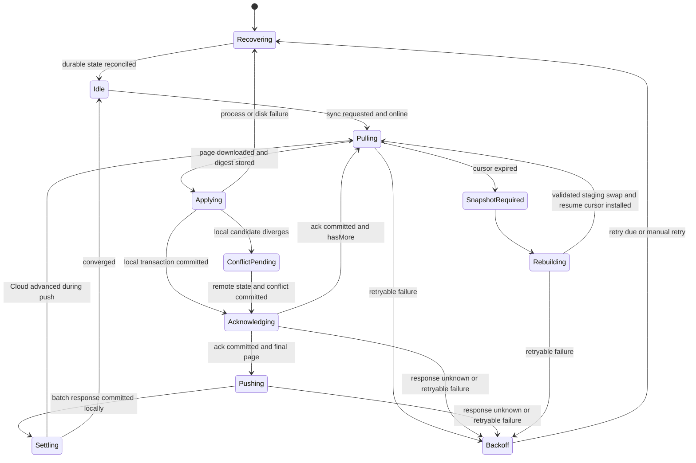
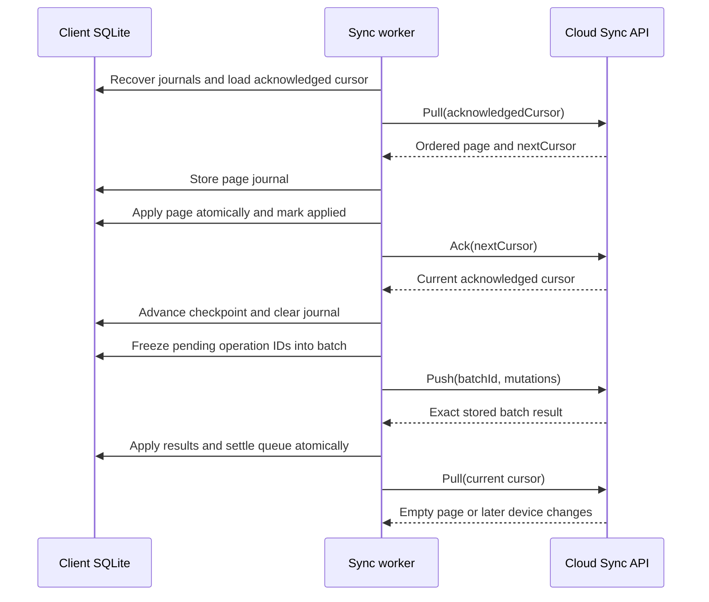
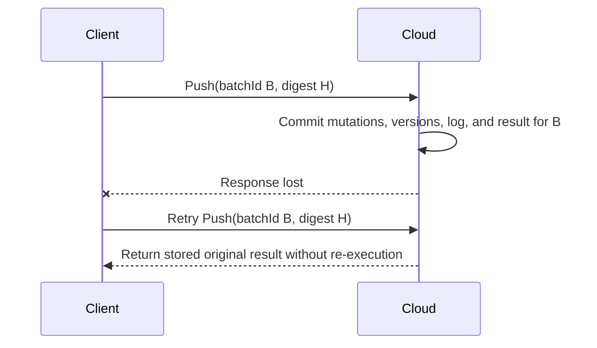

# ADR-0004: Sync v1 Cursors, Idempotency, Compaction, and Recovery

- Status: Accepted
- Date: 2026-08-13
- Decision owners: TestPapers maintainers
- Linear: [CLE-94](https://linear.app/clearders/issue/CLE-94)
- Parent: [CLE-29](https://linear.app/clearders/issue/CLE-29)
- Depends on: [ADR-0003](0003-sync-v1-wire-protocol.md)
- Sync protocol version: `1`

## Context

ADR-0003 fixes the Sync v1 operations, mutation and result shapes, transactional Push behavior, opaque cursor boundary, snapshots, conflict resources, attachment operations, and stable errors. This ADR completes the protocol safety model for at-least-once delivery and finite history retention.

The protocol must remain correct when requests or responses are duplicated, delayed, reordered, or lost; a process exits between a local commit and network acknowledgement; a device is offline longer than the Cloud change-log retention horizon; or a snapshot rebuild overlaps unsynchronized local work. None of those failures may silently discard a local candidate, resurrect a tombstone, or create a second semantic version from replay.

## Decision

Sync v1 uses a Cloud-issued opaque cursor over an account-scoped monotonic change-log position, persistent client checkpoints, exact idempotency replay, and a staging-and-swap snapshot recovery process. The correctness sequence is always:

`recover → pull → apply locally → acknowledge → push → settle`

Network availability may pause the sequence but never reorder its durable transitions. Push is not attempted while the client has an uncommitted or unacknowledged Pull page. This ensures a candidate is evaluated against the newest Cloud state the device has durably observed.

## Persistent client state

For every authenticated `(accountId, deviceId)`, a client persists:

| Field | Meaning |
| --- | --- |
| `acknowledgedCursor` | Last cursor both committed locally and acknowledged by Cloud |
| `issuedCursor` | End cursor of the current downloaded page, if any |
| `pageState` | `none`, `downloaded`, `applying`, `applied`, or `acknowledging` |
| `pageDigest` | SHA-256 of the ordered page used to detect changed replay data |
| `queueState` | Global worker state from the state machine below |
| `pendingMutations` | Immutable operation bodies plus dependency, attempt, and retry metadata |
| `inFlightBatch` | Batch ID, canonical digest, and exact ordered operation IDs |
| `snapshotState` | Snapshot ID, page cursor, resume cursor, staging generation, and validation status |
| `retryState` | Attempt count, next attempt instant, last stable error code, and retry class |

Entity candidates, pending mutations, conflicts, and blobs are stored separately from the acknowledged replica projection. A client MUST NOT derive a cursor from entity timestamps or versions.

## Cloud cursor model

The Cloud appends every accepted semantic mutation to an account-visible change log in the same transaction as current state and immutable history. Each log row receives a strictly increasing server sequence. A cursor is an authenticated opaque encoding of:

- protocol version;
- account scope;
- device scope when the cursor was issued for that device;
- logical position immediately before the next unread change;
- issuance generation used to reject tokens invalidated by a rebuild or protocol transition.

Cursor contents and signatures are implementation details. Clients store and echo the token unchanged. The Cloud MUST distinguish:

- invalid cursor: malformed, fabricated, wrong account/device, or ahead of a position issued to that device;
- expired cursor: authentic but older than retained incremental history;
- current cursor: valid and no later authorized changes exist.

Authorization filtering is stable within a page. Losing access produces an appropriate tombstone/removal change before later rows become unreadable, so a replica does not retain an indefinitely live projection merely because its list permission changed.

## Pull, apply, and acknowledgement state machine

The durable transitions are:

1. `Pulling → Applying`: store response body or normalized changes, input/output cursors, page digest, and `pageState=downloaded` before applying any change.
2. `Applying → Acknowledging`: in one local transaction apply every change in order, create any conflicts, store the output cursor as `issuedCursor`, and set `pageState=applied`.
3. `Acknowledging → Pulling|Pushing`: repeat Ack until Cloud returns success; then atomically replace `acknowledgedCursor` with `issuedCursor` and clear the page journal.
4. `Pushing → Settling`: repeat the identical batch ID and bytes until the exact stored response is obtained; apply results and queue removals in one local transaction.
5. `Settling → Pulling`: perform a final Pull from the acknowledged cursor because other devices may have written while Push ran.

A conflict discovered while applying Pull stores the remote current snapshot, local candidate, and its common base in the same local transaction. The acknowledged replica may advance to the remote version, but the user candidate remains in conflict storage and is never deleted as an implicit side effect of acknowledgement.

## Normal sync sequence

## Crash and unknown-response recovery

On every startup and before new network work, the client executes deterministic recovery:

| Durable state found | Recovery action |
| --- | --- |
| `downloaded` | Verify the stored digest, then apply the same stored page; do not Pull again |
| `applying` | SQLite rollback guarantees no partial transaction; reset to `downloaded` and reapply |
| `applied` or `acknowledging` | Repeat Ack for `issuedCursor`; do not reapply or Push |
| `inFlightBatch` without stored result | Rebuild exactly the same body and repeat the same batch ID |
| stored batch result not settled | Reapply the response to queue state idempotently, then settle |
| snapshot staging incomplete | Resume the same snapshot session if valid; otherwise discard only staging and restart |

### Cloud committed Push but response was lost

The client MUST NOT mint a new batch ID merely because a response timed out. A new ID is created only when the membership or canonical body of a not-yet-submitted batch changes. Once submitted, operation bodies are immutable until their results are settled.

### Pull response or acknowledgement was lost

- If Pull response loss occurs before journaling, repeat Pull with the same acknowledged cursor.
- If it occurs after journaling, use the journal; a repeated identical page is harmless.
- If Ack response is lost, repeat Ack with `issuedCursor`. Ack is monotonic and idempotent.
- The client never rolls its local projection backward to the prior acknowledged cursor after a page transaction has committed.

## Idempotency retention and replay

Batch identity is scoped to the authenticated account and device. Operation identity is scoped to the authenticated account. The Cloud stores:

- canonical request digest;
- protocol version and authenticated device;
- complete ordered result, including conflicts and assigned versions;
- created and last-replayed timestamps;
- a non-secret diagnostic request ID.

An exact replay returns the stored result even if current entity state has advanced since the original execution. It does not repeat authorization-dependent disclosure beyond that result: the device token must still be valid and belong to the same account/device. A revoked token cannot retrieve replay data.

Idempotency records MUST be retained at least as long as the longest supported offline/retry horizon and never less than 90 days after the last replay. They MUST NOT be purged while a registered device reports the operation as unsettled. Final retention values remain deployable policy, but the server advertises `idempotencyRetentionDays` in sync capabilities.

Within a batch, savepoint rollback creates a durable rejected/conflict result but no accepted entity version. A dependent operation is never attempted when its dependency is not `applied` or `noop`. Retrying the batch returns the same dependency outcome even if the underlying cause later changes; the client resolves it through a new operation ID.

## Retry classification and backoff

Retry behavior is driven by ADR-0003 error classification:

| Class | Examples | Client action |
| --- | --- | --- |
| immediate exact replay | connection reset, response timeout, HTTP 502/503/504 | Retry unchanged request and idempotency key |
| delayed exact replay | 429, transient storage unavailable | Honor `Retry-After`, then retry unchanged request |
| refresh then replay | access token expired | Refresh once, then retry unchanged request |
| pause for authentication | refresh expired, device/account revoked | Preserve all data; expose `authenticationRequired` |
| transform workload | batch too large | Split only a never-submitted batch; preserve operation IDs and dependencies |
| snapshot recovery | cursor expired | Enter the snapshot state machine |
| user/developer action | conflict, validation, forbidden, schema unsupported, idempotency mismatch | Do not blind retry |

Exponential backoff uses full jitter with a 1-second base and 5-minute cap. A success resets the consecutive-failure counter. Foreground manual retry may bypass the current delay once but cannot bypass authentication, schema, conflict, or integrity failures. Network status hints may pause attempts; they are not proof that an operation failed.

## Change-log compaction and cursor expiry

The Cloud retains immutable entity history independently from the incremental delivery log. Compaction may remove change-log rows only when all of these hold:

1. The row is older than the configured minimum retention window, initially 90 days.
2. A consistent current-state snapshot can reproduce its semantic effect, including tombstones within their retention period.
3. No active compaction lease or snapshot session references the row.
4. The resulting oldest retained sequence and snapshot boundary are committed atomically.

Device acknowledgement is an observability and safe-cleanup signal, not an unlimited retention promise. A device behind the compacted horizon receives `SYNC_CURSOR_EXPIRED`; the server never fabricates an incremental bridge.

Tombstones and accepted entity versions have separate retention policies. A tombstone MUST survive beyond both the maximum incremental history window and every active device acknowledgement horizon needed to prevent stale resurrection. Until an explicit production policy proves a safe physical purge, the implementation keeps tombstones and favors recovery.

## Snapshot rebuild state machine

```mermaid
stateDiagram-v2
    [*] --> Requested
    Requested --> Downloading: snapshotId and first page received
    Downloading --> Downloading: page validated and staged
    Downloading --> Validating: final page and resumeCursor received
    Validating --> ReadyToSwap: schema, hashes, references, and completeness valid
    Validating --> Failed: validation or integrity error
    ReadyToSwap --> Swapping: exclusive local transaction begins
    Swapping --> CatchingUp: replica generation and resumeCursor committed
    Swapping --> Recovering: process or disk failure
    CatchingUp --> Complete: intervening Pull pages applied and acknowledged
    Downloading --> Requested: snapshot session expired; discard staging only
    Failed --> Requested: user or automatic retry
    Recovering --> CatchingUp: committed new generation found
    Recovering --> Requested: old generation remains authoritative
```

Snapshot recovery uses new staging tables/files identified by a generation ID. It MUST NOT mutate the active acknowledged replica while pages are downloading. Every page is checked for protocol/schema support, stable IDs, canonical hashes, reference validity, duplicate identity/version, and advertised page digest.

The swap transaction:

1. freezes queue scheduling but not creation of local mutations;
2. records the active replica generation and all pending/conflict/blob references;
3. promotes validated staging rows for the synchronized account;
4. preserves local-private entities and all unacknowledged candidate state;
5. reattaches pending candidates to their common bases or creates explicit conflicts when the base is absent/divergent;
6. installs the snapshot `resumeCursor` as issued-but-not-yet-acknowledged;
7. commits atomically, after which old replica rows may be cleaned asynchronously.

If the process exits during swap, SQLite transactionality selects either the old or new complete generation. Startup never attempts to infer a half-swapped state from row counts.

After swap, the client Pulls from `resumeCursor` to catch writes committed after the snapshot boundary. It acknowledges only after those pages are locally committed. Pending mutations are pushed only after catch-up completes.

## Out-of-order and duplicate changes

- Pages are consumed only through issued cursors; clients do not merge independently fetched pages by timestamp.
- Within a page, the Cloud sequence is authoritative. A client rejects a page with non-increasing or duplicate sequence entries unless the complete page digest exactly matches an already journaled page.
- A change matching the stored entity `(version, contentHash)` is a no-op.
- A lower version matching immutable history is a delivery duplicate and does not roll current state back.
- A lower or equal version with a different hash is protocol/data corruption and pauses sync with a non-retryable integrity failure.
- A higher version that skips versions is valid only when its complete snapshot and change metadata declare compaction or authorization filtering; otherwise the client enters snapshot recovery.

## Multiple devices and concurrent writes

Each device has an independent acknowledged cursor but all devices share account-visible canonical versions and idempotency operation identities. Concurrent changes to different entities apply independently. Concurrent changes to the same entity based on the same base result in exactly one accepted successor; later contenders become conflicts regardless of device clocks or arrival timestamps.

Delete/update and delete/restore races follow the same rule. A restore can succeed only against the current tombstone. A late update based on the pre-delete live version becomes a conflict and cannot resurrect the row.

## Protocol and schema upgrades

The server publishes supported protocol and entity schema versions through sync capabilities. During a protocol transition it supports an explicit overlap window:

1. old and new readers coexist;
2. server writes remain readable by both or are gated per account/entity;
3. clients upgrade generated contracts and local migrations before enabling new writes;
4. old writes are disabled only after usage evidence and the advertised deadline;
5. an unsupported client pauses Cloud sync while retaining local editing and pending data.

Changing cursor interpretation invalidates only affected cursors and provides snapshot recovery. It never asks clients to delete their queue. Changing canonical entity content increments `schemaVersion` and supplies a deterministic transform before its hash participates in Sync.

## Required recovery tests

Implementations MUST provide deterministic scenarios for:

- crash before page journal, after journal, during apply, after apply, during Ack, and after Ack;
- Cloud commit followed by lost Push response and repeated exact replay;
- duplicate and delayed Pull pages, duplicate Ack, and duplicate batch result settlement;
- two devices updating the same base, update versus delete, and delete versus explicit restore;
- token expiry, refresh expiry, device revocation, rate limiting, and server outage;
- cursor expiry during idle, during pagination, and immediately after snapshot swap;
- snapshot session expiry, invalid page hash, disk-full/write failure, and crash during swap;
- compaction with offline devices and retained tombstones;
- protocol/schema overlap and unsupported-client pause.

For every scenario, the oracle asserts: accepted semantic versions are unique, acknowledged changes exist in the active replica, pending candidates remain recoverable, conflicts preserve all three inputs, tombstones are not silently resurrected, and retries converge or expose a stable actionable state.

## Consequences

### Positive

- Every interruption point has one durable recovery action.
- Cloud compaction remains finite without treating an offline client as data loss.
- Exact replay and page journaling close the commit/response uncertainty window.
- Snapshot recovery replaces only acknowledged replica state and preserves local work.

### Costs

- Clients maintain journals, generation staging, retry metadata, and exact in-flight batch bodies.
- Snapshot rebuild temporarily requires space for two replica generations.
- Cloud retains replay results and coordinates compaction with snapshot leases.
- Pull-before-Push may add latency but removes an avoidable stale-base window.

## Acceptance checklist

- [x] Pull, local apply, Ack, Push, settle, and restart transitions are explicit.
- [x] Lost responses and every durable intermediate state have deterministic recovery.
- [x] Exact idempotency replay, savepoint failure, and dependency behavior are fixed.
- [x] Retryable, authentication, snapshot, transform, and user-action failures are separated.
- [x] Compaction, cursor expiry, tombstone safety, and snapshot staging/swap are defined.
- [x] Snapshot rebuild preserves pending mutations, local-private data, conflicts, and blobs.
- [x] Duplicate, out-of-order, multi-device, and delete/restore behavior is explicit.
- [x] Protocol and entity-schema upgrade behavior is defined.
