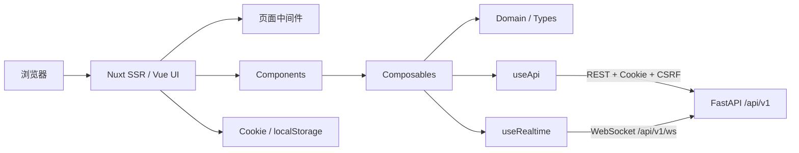
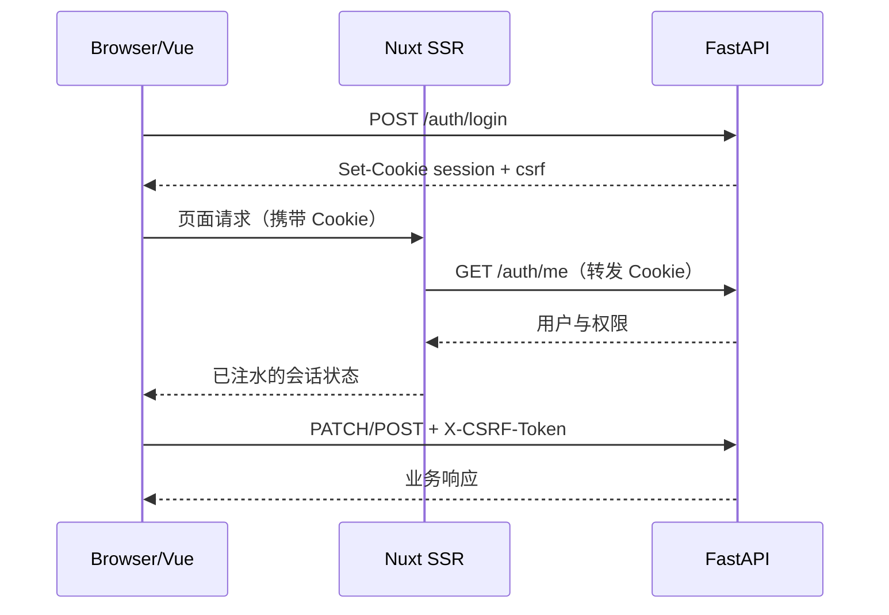

# TestPapers 前端技术文档

> 文档版本：1.0  
> 对应代码：`TestPapers/`  
> 基线：Nuxt 4.4.8、Vue 3.5.32、TypeScript 5.7  
> 更新日期：2026-07-16

## 1. 项目定位

TestPapers 前端是一个支持服务端渲染的试卷工作台，提供题库管理、手工组卷、遗传算法组卷、LaTeX 预览、试卷保存与 DOCX 导出、云端共享草稿、评论审批及实时协作等能力。

前端不直接持久化业务主数据。题目、试卷、用户和共享草稿通过 FastAPI API 保存；浏览器本地只保存主题、临时工作区草稿及本地试卷草稿等客户端状态。

## 2. 技术栈

| 技术 | 当前版本 | 用途 |
| --- | --- | --- |
| Nuxt | `^4.4.8` | SSR、路由、运行时配置、Nitro 服务端 |
| Vue | `^3.5.32` | 组件与响应式状态 |
| Vue Router | `^4.5.1` | 文件路由与导航守卫 |
| TypeScript | `^5.7.0` | 类型约束 |
| Nuxt Security | `2.5.1` | CSP、安全响应头、SRI |
| KaTeX | `^0.16.21` | 数学公式渲染 |
| Cropper.js | `^2.1.1` | 头像裁剪 |
| ESLint | `^10.5.0` | 静态检查 |
| PM2 | 外部依赖 | 生产环境 Nuxt 进程管理 |

依赖的权威来源为 [`package.json`](../TestPapers/package.json)。

## 3. 总体架构



主要分层：

- `pages/`：路由入口，组合业务组件并声明访问要求。
- `components/`：可复用 UI 和工作区功能块。
- `composables/`：请求、鉴权、题库、草稿、导出和实时连接等有状态逻辑。
- `domain/`：题目、试卷和草稿的纯业务规则、标准化与转换。
- `types/`：API DTO、领域模型及路由元数据类型。
- `utils/`：端点、错误、文件和格式化等无状态工具。
- `middleware/`、`plugins/`：全局路由兼容、权限控制和客户端会话恢复。

## 4. 目录说明

```text
TestPapers/
├─ app/
│  ├─ app.vue
│  ├─ assets/css/main.css
│  ├─ components/
│  │  └─ questions/
│  ├─ composables/
│  ├─ domain/{drafts,papers,questions}/
│  ├─ layouts/default.vue
│  ├─ middleware/
│  ├─ pages/
│  ├─ plugins/
│  ├─ types/
│  └─ utils/
├─ docs/
├─ public/
├─ scripts/
├─ server/middleware/
├─ shared/
├─ nuxt.config.ts
└─ package.json
```

## 5. 页面与访问控制

| 路由 | 页面文件 | 主要功能 | 访问条件 |
| --- | --- | --- | --- |
| `/` | `pages/index.vue` | 首页与功能入口 | 公开 |
| `/questions` | `pages/questions.vue` | 题库/组卷统一工作区 | 页面公开，具体操作按权限控制 |
| `/add-problem` | `pages/add-problem.vue` | 新建题目及实时预览 | 登录且具有 `questions:write` |
| `/latex` | `pages/latex.vue` | LaTeX 预览 | 公开 |
| `/login` | `pages/login.vue` | 登录 | 仅未登录用户 |
| `/register` | `pages/register.vue` | 注册 | 仅未登录用户 |
| `/account` | `pages/account.vue` | 资料、密码、头像与注销账户 | 登录 |
| `/users` | `pages/users.vue` | 用户角色和启用状态管理 | 登录且具有 `users:manage` |

`app/middleware/auth.global.ts` 在导航前等待会话状态就绪，并处理：

1. `guestOnly` 页面：已登录用户重定向到首页。
2. `requiresAuth` 页面：未登录用户重定向到登录页，并携带返回地址。
3. `permissions` 页面：缺少任一声明权限时重定向到首页。

页面守卫只改善前端体验，真正的安全边界仍由后端权限依赖和资源所有权检查提供。

## 6. 核心组件

| 组件 | 职责 |
| --- | --- |
| `QuestionWorkspace.vue` | 统一编排题库、试卷编辑、草稿与路由状态 |
| `QuestionBankPanel.vue` | 题库筛选、分页和选题入口 |
| `QuestionCardList.vue` | 题目列表呈现与交互 |
| `PaperBuilderPanel.vue` | 手工组卷、排序、分值及临时编辑 |
| `PaperGenerationForm.vue` | 自动组卷参数表单 |
| `PaperLivePreview.vue` | 试卷实时预览 |
| `PaperExportPanel.vue` | 保存、打印、DOCX 导出设置 |
| `ExamDraftPanel.vue` | 浏览器本地试卷草稿管理 |
| `CloudDraftPanel.vue` | 云端共享草稿、协作者和审批状态 |
| `DraftCommentsDrawer.vue` | 草稿级/题目级评论与解决状态 |
| `LatexRenderer.vue`、`LatexText.vue` | KaTeX 公式解析和渲染 |
| `AvatarCropper.vue` | PNG 头像裁剪和上传准备 |

题库的新增、编辑、详情、导入、图片、修订历史和纠错等功能位于 `app/components/questions/`。

## 7. 状态与业务逻辑

前端未引入独立的全局状态库，跨组件状态由 Nuxt `useState`、Vue `ref/computed` 及 composable 共同管理。

| Composable | 主要职责 |
| --- | --- |
| `useApi` | REST 请求、统一信封解包、超时、GET 重试、401 刷新、Blob 下载 |
| `useAuth` | 登录、注册、会话恢复、资料/密码/头像/账户操作、权限判断 |
| `useQuestionBank` | 题库与个人题库、筛选分页、元数据、实时增量更新 |
| `useWorkspaceDraft` | 当前工作区自动保存和浏览器本地试卷草稿 |
| `useSharedDrafts` | 云草稿 CRUD、乐观锁、协作者、评论、审批、云草稿导出 |
| `usePaperQuestionActions` | 选题、移除、排序及临时题目编辑 |
| `usePaperExport` | 保存试卷、导出预览、打印和 DOCX 下载 |
| `useRealtime` | WebSocket 建连、心跳、重连与事件订阅 |
| `useQuestionWorkspaceRouteState` | 工作区标签、筛选和分页与 URL 查询参数同步 |
| `useTheme` | 明暗主题 Cookie 和页面元信息同步 |

领域层的职责：

- `domain/questions/`：题型常量、表单模型、类型守卫、导入和标准化。
- `domain/papers/`：试卷问题引用、分值和导出相关转换。
- `domain/drafts/`：本地/共享草稿状态的序列化与校验。

组件应优先调用领域函数和 composable，避免在模板中重复实现 DTO 转换或业务校验。

## 8. API 客户端

`app/composables/useApi.ts` 是唯一的通用 HTTP 客户端入口。

### 8.1 请求行为

- 默认 API 根路径为 `/api/v1`。
- 浏览器请求使用 `credentials: 'include'` 发送 Cookie。
- SSR 请求转发原始 `cookie` 请求头。
- JSON 请求自动设置 `Content-Type: application/json`。
- `POST`、`PUT`、`PATCH`、`DELETE` 从 `testpapers_csrf` Cookie 读取令牌，并发送 `X-CSRF-Token`。
- 普通 JSON 请求默认超时 15 秒；下载请求使用原生 `fetch`。
- GET 请求对部分网络错误和服务端错误进行有限重试。
- 可恢复的 `401` 会触发一次 `/auth/refresh`，成功后重试原请求；刷新失败则清空会话。

### 8.2 响应格式

正常响应：

```json
{
  "success": true,
  "data": {},
  "meta": { "requestId": "uuid" }
}
```

错误响应由 `utils/apiError.ts` 转换为前端可处理的错误对象；页面应优先展示后端 `message`，并在排障时记录 `requestId`。

完整 REST 契约见 [`TestPapers/docs/api-spec.md`](../TestPapers/docs/api-spec.md)。

## 9. 鉴权与权限

### 9.1 会话流程



- 会话 Cookie 为 HttpOnly，前端 JavaScript 不读取令牌。
- CSRF Cookie 可由前端读取，仅用于生成变更请求头。
- `useAuth` 维护 `user`、`isAuthenticated`、`isAuthReady`。
- 客户端插件 `auth-session.client.ts` 负责浏览器端会话恢复/同步。
- SSR 状态使用请求级对象，避免不同用户之间共享认证状态。

### 9.2 角色权限

| 权限 | admin | teacher | viewer |
| --- | --- | --- | --- |
| `questions:read` | 是 | 是 | 是 |
| `questions:write` | 是 | 是 | 否 |
| `questions:delete` | 是 | 是 | 否 |
| `answers:read` | 是 | 是 | 否 |
| `papers:read` | 是 | 是 | 是 |
| `papers:write` | 是 | 是 | 否 |
| `users:manage` | 是 | 否 | 否 |

对于 viewer，后端还会从题目、修订、试卷预览、共享草稿及导出结果中移除答案。

## 10. 题库与组卷数据流

### 10.1 题库

1. `useQuestionWorkspaceRouteState` 从 URL 解析搜索词、题型、难度、LaTeX、标签、学科和分页。
2. `useQuestionBank` 请求 `/questions` 或 `/questions/mine`。
3. 返回的分页数据写入 Nuxt 状态并由题库组件呈现。
4. 新增、编辑、删除完成后，本地状态立即更新。
5. WebSocket 事件用于同步其他会话产生的题目变化。

支持题型：单选、多选、判断、填空、简答、论述。

### 10.2 试卷

工作区内部用题目快照和问题引用维护当前试卷，可执行：

- 手工选题、移除、上下移动、设置分值；
- 对当前试卷中的题目做不落库的临时编辑；
- 按学科、题型数量、难度系数、必需/偏好标签和个人题库范围自动组卷；
- 保存为持久化试卷或浏览器本地草稿；
- 打印或下载 DOCX。

临时题目编辑不会更新题库。直接草稿导出使用 `/papers/draft-download`；保存后的试卷使用 `/papers/{id}/download`。

## 11. 共享草稿与实时协作

共享草稿与持久化试卷相互独立。草稿的 `state` 保存工作区快照、导出模式、版面密度及是否包含答案等设置。

### 11.1 乐观锁

更新请求带 `baseRevision`。后端仅在版本匹配时写入，并递增 `revision`；发生冲突时返回 `409 DRAFT_REVISION_CONFLICT`。前端将当前草稿标记为陈旧，要求用户重新加载，防止静默覆盖协作者的修改。

### 11.2 草稿角色

- `owner`：内容、共享、评论、审批和删除的完全控制。
- `editor`：可编辑内容并提交审核。
- `viewer`：可查看与评论，不可修改内容。
- `admin`：可访问全部共享草稿。

存在未解决评论时不能批准草稿。

### 11.3 WebSocket

连接地址默认由 API 地址推导为 `/api/v1/ws`。浏览器通过会话 Cookie 鉴权，不在 URL 中传递令牌。

`useRealtime` 提供：

- 连接状态和错误状态；
- `ping/pong` 心跳；
- 指数退避并带抖动的重连；
- 重连前的会话刷新；
- `on(event, handler)` 订阅和注销。

主要事件包括 `question.*`、`paper.*`、`draft.updated`、`draft.deleted`、`draft.review.updated`、`draft.comment.*` 和 `pong`。

## 12. LaTeX、文件与导出

- `parseLatexParts` 将普通文本与行内/块级公式拆分。
- `LatexRenderer` 使用 KaTeX 渲染，失败时保留可读文本而不是中断页面。
- 题目图片只接受后端允许的 PNG 数据，显示时遵循 CSP 的 `self/data/blob` 来源限制。
- DOCX 由后端生成；前端只提交导出选项、接收 Blob、解析文件名并触发浏览器保存。
- 是否包含答案同时受用户设置和 `answers:read` 权限控制。

## 13. 运行时配置

| 环境变量 | 默认值 | 说明 |
| --- | --- | --- |
| `NUXT_PUBLIC_API_BASE` | `/api/v1` | 浏览器同源 API 路径 |
| `NUXT_PUBLIC_DIRECT_API_BASE` | 同 `NUXT_PUBLIC_API_BASE` | Blob 等浏览器直连地址 |
| `NUXT_API_BASE` | `http://127.0.0.1:8000/api/v1` | Nuxt 服务端访问后端的地址 |
| `NUXT_SERVER_API_BASE` | 同上 | 服务端 API 地址兼容项 |
| `NUXT_PUBLIC_WS_BASE` | 空 | 显式 WebSocket 地址；空时自动推导 |
| `NUXT_BUILD_DIR` | Nuxt 默认 | 可选构建目录 |

生产环境建议浏览器始终访问同源 `/api/v1`，由 Nginx 转发到 FastAPI，以简化 Cookie、CORS 和 CSRF 配置。

## 14. 安全设计

`nuxt.config.ts` 配置了以下关键策略：

- 基于 nonce 和 `strict-dynamic` 的脚本 CSP，禁止内联事件处理器；
- `frame-ancestors 'none'`、`X-Frame-Options: DENY` 防点击劫持；
- `object-src 'none'`、`base-uri 'self'`、`form-action 'self'`；
- `Referrer-Policy: same-origin` 和 `X-Content-Type-Options: nosniff`；
- 静态构建资产长期不可变缓存；
- 允许的 `connect-src` 由 API 和 WebSocket 配置自动生成。

反向代理不应使用静态 CSP 覆盖 Nuxt 生成的 nonce CSP。

## 15. 本地开发与质量门禁

```bash
cd TestPapers
npm install
npm run dev
```

默认前端地址通常为 `http://localhost:3000`，后端应运行在 `http://127.0.0.1:8000`。

常用命令：

```bash
npm run lint       # ESLint
npm run typecheck  # TypeScript
npm run build      # Nuxt 生产构建
npm run check      # 专项脚本 + 构建
npm run verify     # lint + typecheck + check
npm run preview    # 预览生产构建
```

专项检查覆盖 SSR 鉴权状态隔离、CSP、试卷领域逻辑、共享草稿、试卷持久化流程和实时重连退避。

## 16. 生产部署

```bash
npm ci
npm run verify
npm run build
pm2 start .output/server/index.mjs --name testpapers
```

推荐拓扑：

```text
Internet -> Nginx
             ├─ /              -> Nuxt :3000
             ├─ /api/v1/*      -> FastAPI :8000
             └─ /api/v1/ws     -> FastAPI WebSocket :8000
```

详细配置见 [`TestPapers/docs/nginx-deployment.md`](../TestPapers/docs/nginx-deployment.md) 和 [`DEPLOYMENT-debian-production.md`](../DEPLOYMENT-debian-production.md)。

## 17. 扩展约定

新增前端功能时建议遵循：

1. 在 `types/` 定义 API DTO 和领域类型。
2. 在 `domain/` 编写可测试的纯转换/校验逻辑。
3. 通过 `useApi` 调用 API，不在页面中重复实现鉴权、刷新和错误解包。
4. 跨组件状态放入专用 composable；展示逻辑保留在组件。
5. 新受限页面声明 `requiresAuth` 和 `permissions`，同时确保后端存在等价校验。
6. 变更 API 时同步更新后端 Schema、前端类型和完整 API 文档。
7. 提交前至少执行 `npm run lint`、`npm run typecheck` 和相关专项检查。

